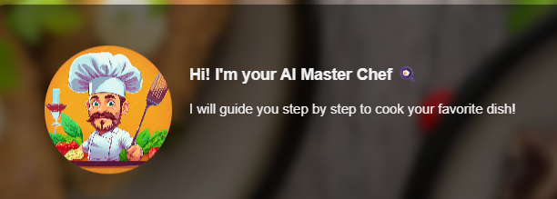
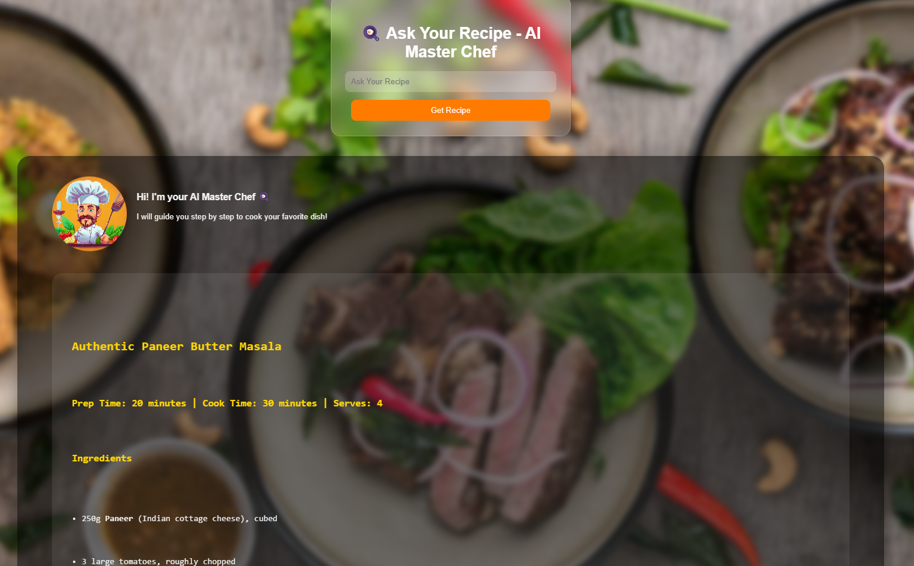

<h1 align="center" style="color: #ff6600; font-size: 3em;">🍳 AI Master Chef</h1>

  <b>AI Master Chef</b> is an intelligent web application that generates cooking recipes using AI (Gemini API). 
  Users can type any dish name or available ingredients, and the AI provides a detailed recipe — all served with an elegant, glassy UI and chef animation.

  

<h2 style="color: #ff6600;">🚀 Features</h2>
<ul style="font-size: 1.1em; color: #444;">
  <li>🧠 <b>AI-Powered Recipes:</b> Uses Google Gemini to generate custom recipes.</li>
  <li>🧑‍🍳 <b>Chef Animation & Intro:</b> Friendly animated chef introduces each recipe.</li>
  <li>🪞 <b>Modern Glassmorphism UI:</b> Smooth blurred background and dynamic design.</li>

  <li>💾 <b>Session-Based Output:</b> Keeps recent recipe responses for the session.</li>
  <li>⚙️ <b>Environment Security:</b> Uses <code>.env</code> to store API keys safely.</li>
</ul>

<h2 style="color: #ff6600;">🧩 Tech Stack</h2>
<table style="border-collapse: collapse; width: 100%; font-size: 1.1em; color: #444;">
  <tr style="border-bottom: 1px solid #ccc;">
    <th style="text-align: left; padding: 8px;">Layer</th>
    <th style="text-align: left; padding: 8px;">Technology Used</th>
  </tr>
  <tr>
    <td style="padding: 8px;">Frontend</td>
    <td style="padding: 8px;">HTML, CSS (Glassmorphism UI), JavaScript</td>
  </tr>
  <tr>
    <td style="padding: 8px;">Backend</td>
    <td style="padding: 8px;">Django (Python)</td>
  </tr>
  <tr>
    <td style="padding: 8px;">AI Model</td>
    <td style="padding: 8px;">Google Gemini API</td>
  </tr>
  <tr>
    <td style="padding: 8px;">Database</td>
    <td style="padding: 8px;">SQLite (default Django DB)</td>
  </tr>
  <tr>
    <td style="padding: 8px;">Others</td>
    <td style="padding: 8px;">dotenv for environment variables</td>
  </tr>
</table>

<h2 style="color: #ff6600;">📁 Project Structure</h2>
<pre style="background: #f7f7f7; padding: 10px; border-radius: 10px; font-size: 1.05em;">
AI-Master-Chef/
├── chef/                     
│   ├── migrations/           
│   ├── static/               
│   │   └── chef/css/style.css
│   ├── templates/chef/       
│   │   └── home.html
│   ├── forms.py              
│   ├── views.py              
│   ├── langchain.py          
│   └── models.py             
├── media/                    
├── chefdjango/               
│   ├── settings.py           
│   ├── urls.py               
│   └── wsgi.py               
├── .env                      
├── .gitignore                
├── README.md                 
├── manage.py                 
└── requirements.txt          
</pre>

<h2 style="color: #ff6600;">⚙️ Installation & Setup (Run Locally)</h2>
<ol style="font-size: 1.1em; color: #444;">
  <li>
    <b>Clone the Repository:</b> 
    <code>git clone https://github.com/puneetyadav/AI-Master-Chef.git</code> 
    <code>cd AI-Master-Chef</code>
  </li>
  <li>
    <b>Create and Activate Virtual Environment:</b> 
    <code>python -m venv venv</code> 
    <code>venv\Scripts\activate</code> (Windows) 
    <code>source venv/bin/activate</code> (macOS/Linux)
  </li>
  <li>
    <b>Install Dependencies:</b> 
    <code>pip install -r requirements.txt</code>
  </li>
  <li>
    <b>Set Up Environment Variables:</b> 
    Create a file named <code>.env</code> in the root folder: 
    <code>GOOGLE_API_KEY="your-gemini-api-key-here"</code>
  </li>
  <li>
    <b>Run Migrations:</b> 
    <code>python manage.py migrate</code>
  </li>
  <li>
    <b>Start the Development Server:</b> 
    <code>python manage.py runserver</code> 
    Open your browser at <a href="http://127.0.0.1:8000/">http://127.0.0.1:8000/</a>
  </li>
</ol>

<h2 style="color: #ff6600;">🧠 How It Works</h2>
<ol style="font-size: 1.1em; color: #444;">
  <li>User enters a dish name or ingredients in the form.</li>
  <li>The backend sends this input to Gemini AI model.</li>
  <li>The AI returns:</li>
  <ul>
    <li>A short intro about the dish 🍽️</li>
    <li>List of ingredients 🥦</li>
    <li>Step-by-step instructions 👨‍🍳</li>
    <li>Optional tips or serving suggestions ✨</li>
  </ul>
  <li>The result is displayed beautifully below the form with a friendly chef animation.</li>
</ol>

<h2 style="color: #ff6600;">📸 Screenshots</h2>

  
  

<h2 style="color: #ff6600;">📜 License</h2>

This project is licensed under the <b>MIT License</b>. You are free to use, modify, and distribute this project, but the original copyright notice must be included.

<h2 align="center" style="color: #ff6600;">⭐ Star this repo if you like the project!</h2>

